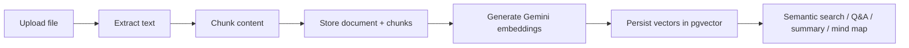

# SKS - Smart Knowledge System

SKS is a document workspace that combines document storage, folder organization, semantic retrieval, and Gemini-powered study assistance in one system. Users can upload source documents, organize them into folders, search by meaning, generate summaries and mind maps, and ask grounded questions against indexed document content.

This repository is organized as a small full-stack monorepo:

- `sks-backend`: NestJS API, PostgreSQL persistence, pgvector-based retrieval, Gemini integration
- `sks-frontend`: React + Vite client for authentication, dashboard, document viewing, summary, search, chat, and mind map UI

## Key Features

- JWT-based authentication with register, login, and profile endpoints
- Upload support for `PDF`, `DOCX`, and `TXT` documents
- Local file storage for uploaded source files
- Automatic text extraction and chunking during upload
- SHA-256 deduplication for repeated uploads
- Folder hierarchy with nested folders and document assignment
- Favorites, rename, delete, and download document actions
- Semantic search powered by `pgvector` embeddings
- Related document suggestions
- AI-generated document summaries
- AI-generated document mind maps
- Document question answering with per-document ask history

## Repository Layout

```text
.
+-- sks-backend/
|   +-- src/
|   |   +-- common/llm/             # Gemini integration
|   |   +-- database/
|   |   |   +-- entities/           # TypeORM entities
|   |   |   +-- migrations/         # Database migrations
|   |   |   +-- repositories/       # Repository layer
|   |   +-- modules/
|   |   |   +-- authentication/     # Auth module
|   |   |   +-- document/           # Upload and document CRUD
|   |   |   +-- folder/             # Folder hierarchy and placement
|   |   |   +-- rag/                # Search, summary, Q&A, mind map
|   |   +-- main.ts                 # App bootstrap
|   +-- uploads/                    # Saved source files
|   +-- runtime-logs/               # Runtime logs (if produced locally)
+-- sks-frontend/
|   +-- src/
|   |   +-- components/             # Reusable UI blocks
|   |   +-- context/                # React context providers
|   |   +-- pages/                  # App pages
|   |   +-- service/                # API wrappers used by UI
|   |   +-- services/               # Shared client utilities
|   +-- vite.config.js
+-- README.md
```

## System Overview

### Backend

The backend is a NestJS application exposed under the global `/api` prefix. Core modules:

- `authentication`: register, login, profile, JWT guard
- `document`: upload, pagination, details, file serving, rename, favorites
- `folder`: nested folders, move, rename, delete, assign/remove documents
- `rag`: semantic search, related documents, summary, mind map, ask history

### Frontend

The frontend is a React 19 + Vite application running on port `3000`. It uses:

- `react-router-dom` for routing
- `axios` for API communication
- `@xyflow/react` + `elkjs` for mind map rendering/layout
- `mermaid` for diagram-related UI support
- `Tailwind CSS` for styling

The frontend expects the API base URL from:

- `VITE_API_BASE_URL`
- fallback: `http://localhost:8000/api`

## Tech Stack

- **Frontend**: React 19, Vite 8, React Router 7, Tailwind CSS
- **Backend**: NestJS 11, TypeScript, TypeORM
- **Database**: PostgreSQL
- **Vector Search**: `pgvector`
- **LLM / Embeddings**: Google Gemini (`gemini-2.5-flash`, `gemini-embedding-001`)
- **Document Parsing**:
  - `pdf-parse` for PDF
  - `mammoth` for DOCX
  - native UTF-8 parsing for TXT
- **Authentication**: JWT + Passport
- **Testing**: Jest, Supertest

## Core Data Model

Important tables created by the migrations:

- `users`: application users
- `document`: canonical uploaded documents and extracted metadata
- `chunks`: chunked text segments used for retrieval
- `user_documents`: user-to-document ownership and favorites
- `folder`: nested folder tree per owner
- `document_ask_history`: question/answer history per document

Important database requirements:

- `pgcrypto` extension for UUID generation
- `vector` extension for embedding storage and similarity search

## RAG Pipeline

At a high level, the document intelligence flow looks like this:



More concretely:

1. User uploads a `PDF`, `DOCX`, or `TXT` file.
2. Backend stores the file under `sks-backend/uploads/`.
3. Text is extracted and split into roughly 1000-character chunks.
4. Chunks are saved to PostgreSQL.
5. Gemini embeddings are generated for each chunk.
6. Embeddings are stored in the `chunks.embedding` vector column.
7. Search and QA retrieve the most relevant chunks by semantic similarity.
8. Summary and mind map generation use representative document context plus Gemini text generation.

Additional implementation notes:

- Upload deduplication is based on file content hash.
- A root folder is created automatically for a user if needed.
- Semantic search can append keyword-based fallback results if semantic confidence is weak.
- Ask history is persisted per document.

## Prerequisites

Before running the project locally, make sure you have:

- Node.js `20+` recommended
- npm `10+` recommended
- PostgreSQL `15+` or `16+`
- A PostgreSQL installation with the `pgvector` extension available
- A valid Gemini API key

If you already have the project source locally, you can skip cloning and start from the project folder directly.

## Getting Started

### 1. Open the repository

If you already have the source:

```bash
cd ss2_s2026_sks
```

If you are cloning from a remote:

```bash
git clone <your-repository-url>
cd ss2_s2026_sks
```

### 2. Configure the backend environment

Copy the backend example environment file:

```bash
cd sks-backend
copy .env.example .env
```

Recommended backend environment values:

```env
PORT=8000
CORS_ORIGIN=http://localhost:3000

DATABASE_HOST=localhost
DATABASE_PORT=5432
DATABASE_USERNAME=postgres
DATABASE_PASSWORD=postgres
DATABASE_NAME=sks
DATABASE_SYNC=false
DATABASE_LOGGING=false

JWT_SECRET=change_me_before_production
JWT_EXPIRES_IN=1d

GEMINI_API_KEY=your_gemini_api_key
GEMINI_TEXT_MODEL=gemini-2.5-flash
GEMINI_EMBEDDING_MODEL=gemini-embedding-001
```

Notes:

- `CORS_ORIGIN` defaults to `http://localhost:3000`, which matches the frontend Vite dev server.
- AI features require `GEMINI_API_KEY`.
- `DATABASE_SYNC` should remain `false` because the project uses migrations.

### 3. Prepare PostgreSQL

Create a database named `sks` and ensure the following extensions are available:

- `pgcrypto`
- `vector`

The migrations themselves will run:

- `CREATE EXTENSION IF NOT EXISTS pgcrypto;`
- `CREATE EXTENSION IF NOT EXISTS vector;`

But PostgreSQL still needs the `pgvector` extension installed on the server beforehand.

### 4. Install backend dependencies

```bash
cd sks-backend
npm install
```

### 5. Run backend migrations

```bash
npm run migration:run
```

### 6. Start the backend

```bash
npm run start:dev
```

The API will be available at:

- `http://localhost:8000/api`

### 7. Configure the frontend environment

There is no committed frontend env example file yet. Create `sks-frontend/.env.local` if you want to override the default API base URL:

```env
VITE_API_BASE_URL=http://localhost:8000/api
```

If you omit this file, the frontend already falls back to `http://localhost:8000/api`.

### 8. Install frontend dependencies

```bash
cd ../sks-frontend
npm install
```

### 9. Start the frontend

```bash
npm run dev
```

The frontend will be available at:

- `http://localhost:3000`

## Local Development Workflow

Once both services are running:

1. Open `http://localhost:3000`
2. Register a new account
3. Log in
4. Upload a `PDF`, `DOCX`, or `TXT` file
5. Open the uploaded document
6. Try:
   - document summary
   - mind map generation
   - ask-document chat
   - semantic search
   - favorites
   - folder organization

## Supported File Uploads

Current backend upload constraints:

- Supported MIME types:
  - `application/pdf`
  - `application/vnd.openxmlformats-officedocument.wordprocessingml.document`
  - `text/plain`
- Max upload size: `10 MB`

If the file is invalid or text extraction fails, the backend returns a `400 Bad Request`.

## API Overview

All backend routes are served under the global prefix:

- `/api`

### Authentication

Base route:

- `/api/auth`

Main endpoints:

- `POST /register`
- `POST /login`
- `GET /profile`

### Documents

Base route:

- `/api/documents`

Main endpoints:

- `POST /upload`
- `GET /`
- `GET /favorites`
- `GET /search`
- `GET /:id`
- `GET /:id/file`
- `GET /:id/related`
- `PATCH /:documentId/update-name`
- `POST /:documentId/toggle-favorite`
- `DELETE /delete`

### Folders

Base route:

- `/api/folders`

Main endpoints:

- `GET /`
- `GET /:id`
- `POST /`
- `PATCH /update`
- `PATCH /move`
- `DELETE /delete`
- `POST /documents/add`
- `DELETE /documents/remove`
- `GET /:folderId/documents`

### RAG / AI Features

Base route:

- `/api/rag`

Main endpoints:

- `POST /documents/:documentId/ask`
- `GET /documents/:documentId/ask/history`
- `DELETE /documents/:documentId/ask/history`
- `POST /documents/:documentId/summary`
- `POST /documents/:documentId/mindmap`
- `POST /documents/:documentId/diagram`

## Backend Scripts

From `sks-backend/`:

```bash
npm run build
npm run start
npm run start:dev
npm run start:debug
npm run start:prod
npm run lint
npm run test
npm run test:watch
npm run test:cov
npm run test:e2e
npm run migration:run
npm run migration:revert
npm run migration:show
```

## Frontend Scripts

From `sks-frontend/`:

```bash
npm run dev
npm run build
npm run lint
npm run preview
```

## Recommended Validation Before Demo or Submission

Backend:

```bash
cd sks-backend
npm run lint
npm run build
npm test -- --runInBand
npm run test:e2e -- --runInBand
```

Frontend:

```bash
cd sks-frontend
npm run lint
npm run build
```

## Frontend Routing

Important client routes:

- `/login`
- `/register`
- `/app`
- `/app/home`
- `/app/favorites`
- `/app/documents/:documentId`

Protected app routes are gated by a local auth token stored in `localStorage`.

## Storage and Persistence Notes

- Uploaded files are stored on local disk under `sks-backend/uploads/`
- JWT auth state is stored in browser `localStorage`
- AI retrieval data is stored in PostgreSQL
- Summary and mind map artifacts are cached in the backend document model

Because uploaded files are stored locally, production deployment should mount persistent storage for:

- `sks-backend/uploads/`

## Production Deployment Notes

This repository does not currently include a committed production deployment manifest such as Docker Compose, Kubernetes, Railway, or Render config.

A practical production topology would be:

- static frontend build served by Nginx or a static host
- NestJS backend running as a Node service
- PostgreSQL with `pgvector`
- persistent volume for uploaded files
- environment-managed Gemini API key and JWT secret

Minimum production checklist:

- set a strong `JWT_SECRET`
- restrict `CORS_ORIGIN`
- back up PostgreSQL regularly
- persist the uploads directory
- monitor Gemini quota and API failures
- disable broad database logging unless needed

## Troubleshooting

### The backend starts but AI features fail

Check:

- `GEMINI_API_KEY` is set correctly
- outbound network access to Gemini is available
- the configured model names are valid for your account

### Migrations fail on `CREATE EXTENSION vector`

Your PostgreSQL server likely does not have `pgvector` installed. Install the extension on the database server first, then rerun:

```bash
cd sks-backend
npm run migration:run
```

### Frontend cannot call the backend

Check:

- backend is running on port `8000`
- frontend is running on port `3000`
- `CORS_ORIGIN=http://localhost:3000`
- `VITE_API_BASE_URL` points to `http://localhost:8000/api`

### Uploaded file appears in the UI but search or summary does not work

Check:

- document indexing completed successfully
- the document contains extractable text
- Gemini embedding calls are working
- the database vector columns were created by the migrations

## Current Gaps / Future Improvements

Based on the current repository state, a few follow-up improvements would make the project easier to operate:

- add a root-level Docker setup for backend + frontend + PostgreSQL
- commit `sks-frontend/.env.example`
- replace template READMEs inside `sks-backend/` and `sks-frontend/`
- add seed data or demo fixture documents
- document deployment on a specific platform

## License

No explicit project license is documented at the repository root at the moment. The backend package is currently marked `UNLICENSED`.
